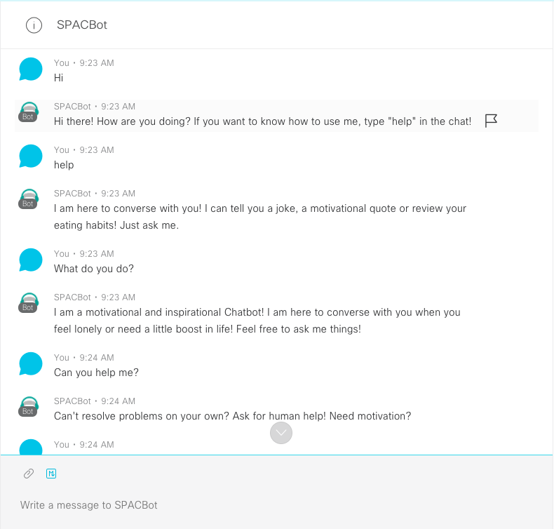
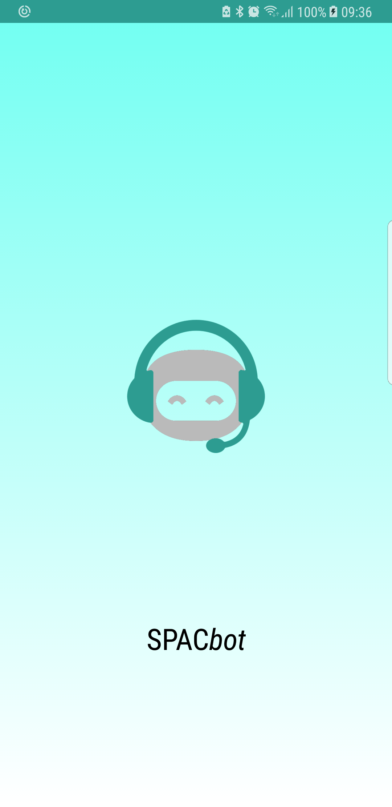
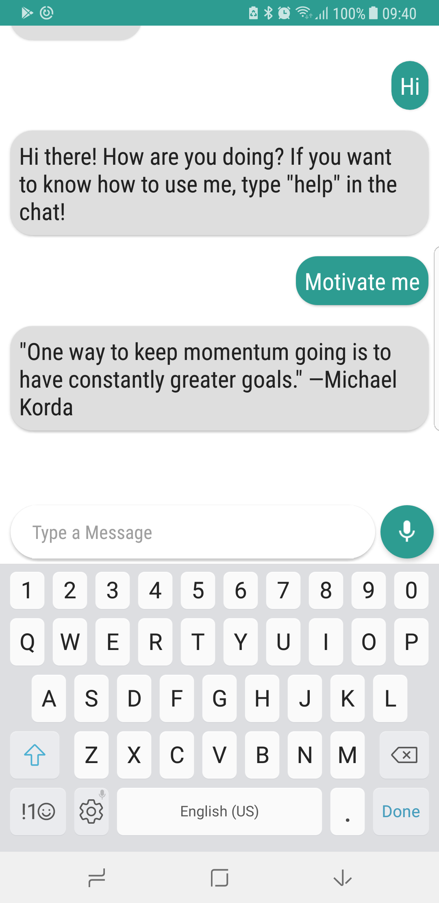

# SPACBot

Everyone, at some point in their lives, would feel like they need support or someone to push them further but, unfortunately, has no one to talk to. 
SPACBot was created to fill that gap. SPACBot is a motivational and inspirational companion to those in needs of a moral support. 
SPACBot was built on February 4th during McHacks 2018 but serves a greater purpose than its creation event. 

## Getting Started

SPACBot is accessible through the [Cisco Spark](https://www.web.ciscospark.com) platform. Once you have created a user, 
you can add the chabot using the following Username: "SPACBot@sparkbot.io".

SPACBot also has an android version under development that could be accessible to users anywhere without using 
Cisco Spark's platform directly. The SDK can be obtained [here](https://github.com/Christiaua/SPACBot/)

## Examples

### Cisco Spark Platform

### Android SDK

## Built With

* [Cisco Spark](https://web.ciscospark.com/) - The main platform used to deploy
* [Dialog Flow](https://dialogflow.com/) - NL AI powering our chatbot
* [SDK Android Studio](https://developer.android.com/studio) - Platform used to build the Android SDK

## Authors
 
[Alexander Chum](https://github.com/AlexChum),
[Christiana Chen](https://github.com/Christiaua),
[Patrick Lai](https://github.com/PatLai),
[Sophie Deng](https://github.com/)

Also available under the list of [contributors](https://github.com/alexchum/McHacks2018/contributors).

## License

This project is licensed under the MIT License - see the [LICENSE.md](LICENSE.md) file for details

## Acknowledgments

McHacks Mentor's,
Cisco Spark's Members
* etc
